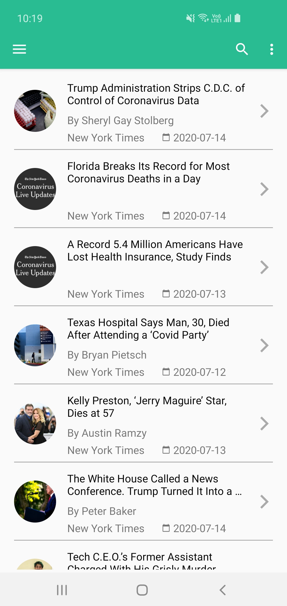
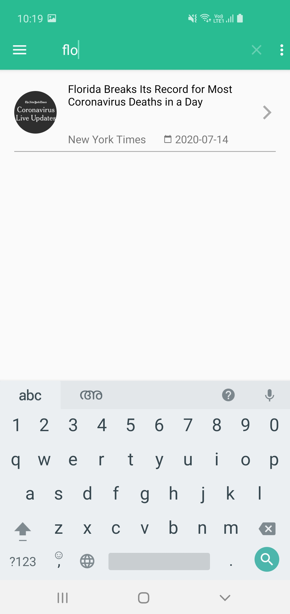

# MVCApplication
Sample App that lists popular Articles from NY Times


## Screens

<p align="center">
  
  
  
</p>


## To Run the Application

***You need to add your API key with "api_key" in string.xml file***


## Installation
Clone this repository and import into **Android Studio**
 ```bash
git@github.com:samsadch/MVCApplication.git
```
            OR
```bash
https://github.com/samsadch/MVCApplication.git
```

## Developed
1. MVC
2. Retrofit server call
3. Simple Unit test using JUnit


## Generating signed APK
From Android Studio:
1. ***Build*** menu
2. ***Generate Signed APK...***
3. Fill in the keystore information *(you only need to do this once manually and then let Android Studio remember it)*

## Maintainers
This project is mantained by:
* [Samsad C V](https://github.com/samsadch)

